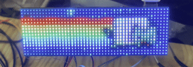
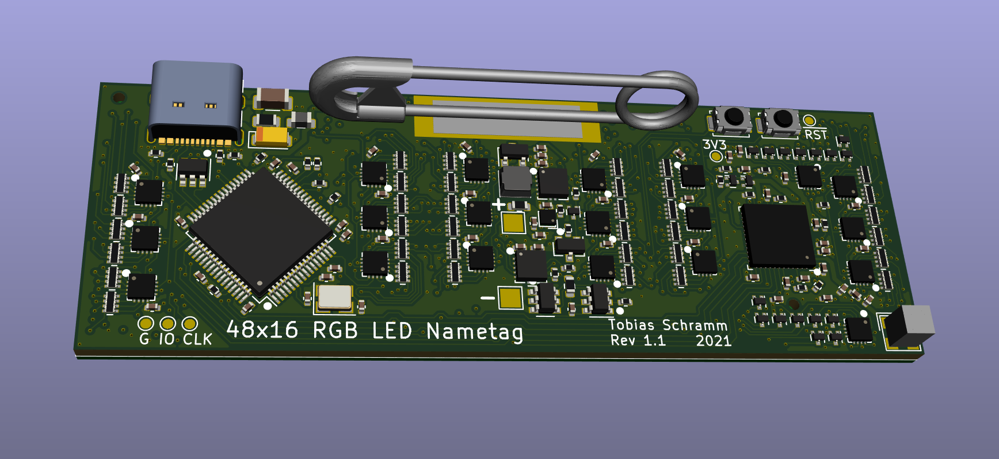
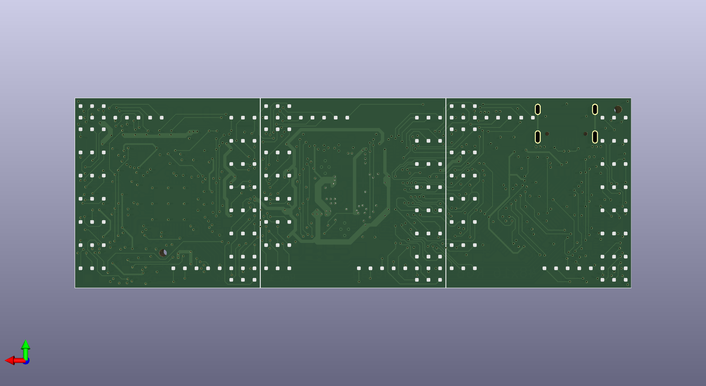
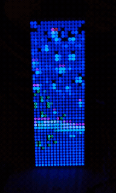

RGB LED nametag
===============

While there are a few commercially available LED nametags out there they
are usually either monochrome only or far too big and bulky to wear.  
This project aims at designing a device solving that problem.  
At only 84mm wide and 29mm tall it is hardly any larger than normal,
boring paper nametags and packs a whole lot more features:

- WLAN enabled
- 48x16 glorious RGB led pixels with more than 16 million colors each
- Powerful ARM Cortex M7 and Xtensa 32bit dual core
- 3MB of onboard data storage

# Principle of operation

The RGB LEDs on this nametag are common anode LEDs. The LEDs are divided
into groups of 16 columns each. The display is then multiplexed over those
16 columns, always driving one of the 16 columns in each of the three
groups simultaneously. Each of the 3 groups features 48 low side row
drivers driving the R, G and B emitter of all 16 LEDs in the currently
selected column.  
Both the low and high side drivers are designed as shift registers. The
low side drivers are fed with data from a regular SPI while the high side
drivers are connected to a QSPI interface. On the QSPI interface three
of the four data lines are utilized to provide data for all three LED
groups simultaneously.  
Both the SPI and QSPI are peripherals of an STM32F722 MCU. The STM32
takes care of LED multiplexing, power management, user io and USB.  
To provide WLAN connectivity an ESP32 is connected to the STM32 via
an IRQ line, a SPI interface, an I2C interface and a UART. IO0 and EN of
the ESP32 are also connected to the STM32. This allows the STM32 to be
used as a USB to UART bridge allowing normal programming of the ESP32
directly from your favourite IDE.

# Assembly

Since double sided assembly and boards with blind vias tends to be on the
expensive side this project is comprised of four boards. The first one is
the board shown above. The remaining three boards are all the same and
carry 16x16 LEDs each. They need to be soldered back to back onto the
mainboard. Design files for the LED carrier boards can be found
[here](https://github.com/TobleMiner/16x16-RGB-led-panel).

